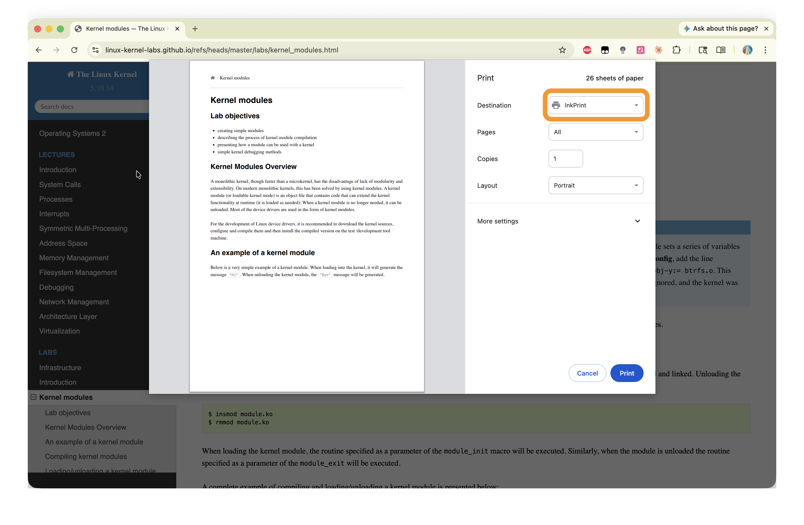
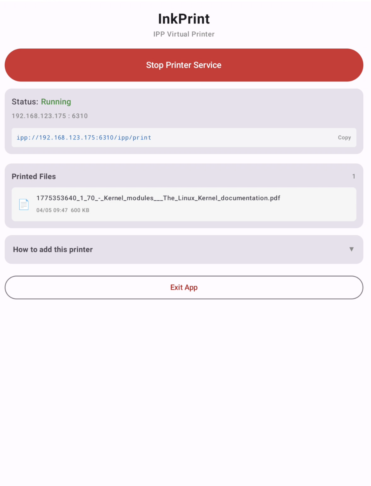

# InkPrint

Turn your BOOX (or any Android e-ink reader) into a wireless network printer.  
Documents printed from any device on your LAN are saved as PDF directly to the BOOX.

| macOS — print to InkPrint from Chrome | Android app — file received |
|:---:|:---:|
|  |  |

---

## The story behind InkPrint

InkPrint was inspired by my daughter, Kiki.

To look after her eyes, Kiki does her reading on an e-ink reader. One day she pointed out that if we cared about the environment, we should be wasting less paper — so why not "print" straight to the e-reader instead?

The idea turned out to be simple and practical. Every computer and phone already knows how to print, so printing to an e-ink reader needs no changes to the apps and systems people already use: pick the printer, press Print, and the document lands on the reader instead of on paper. That is how this app came to be.

Thank you, Kiki. 💚

### 项目缘起

InkPrint 的灵感来自我的女儿 Kiki。

为了保护视力，Kiki 一直用电纸书阅读。有一天她说，为了保护环境，我们应该少浪费一些纸张，那为什么不把要打印的东西直接“打印”到电纸书上呢？

这个想法简单又实用。电脑和手机本来就会打印，打印到电纸书不需要改造任何已有的应用和信息系统：选中打印机，点一下打印，文档就会出现在电纸书上，而不是纸上，既方便又环保。于是就有了这个 App。

谢谢你，Kiki。💚

---

## How it works

```
macOS / Windows / Linux / iOS / Android
        │  print via IPP over WiFi
        ▼
  InkPrint (Android app on BOOX)
  ├── IPP/HTTP server  (port 6310)
  ├── mDNS/Bonjour advertiser  (_ipp._tcp + AirPrint subtype)
  └── Saves PDF to  /Documents/InkPrint/
```

- **IPP 2.0** server implemented in Rust (`inkprint-core` crate)
- **AirPrint** compatible — macOS, iOS, and iPadOS discover it with zero configuration
- **Bonjour/mDNS** advertisement broadcasts both `_ipp._tcp` and `_universal._sub._ipp._tcp` so all major platforms can auto-discover the printer
- **Pure PDF** storage — every print job is saved as a PDF file, ideal for e-ink reading
- Rust core compiled to `aarch64-linux-android` via **cargo-ndk**, bridged to Kotlin via **UniFFI**

---

## Requirements

| Component | Version |
|-----------|---------|
| Android (target device) | 8.0+ (API 26+) |
| Android NDK | r29 |
| Android SDK platform | 36 (compile & target) |
| Rust toolchain | nightly |
| cargo-ndk | latest |
| JDK | 17 |
| macOS build host | Apple Silicon recommended |

---

## Build

```bash
# 1. Build Rust .so for Android arm64
make rust-build-android

# 2. Build APK
cd android
JAVA_HOME=/opt/homebrew/opt/openjdk@17 ./gradlew assembleDebug

# 3. Install on device
adb install -r app/build/outputs/apk/debug/app-debug.apk
```

> **Note:** Use the rustup nightly toolchain (`RUSTC=~/.rustup/toolchains/nightly-aarch64-apple-darwin/bin/rustc`).  
> Homebrew's `rustc` does not include Android targets.

### Release build

Google Play accepts an Android App Bundle, not an APK:

```bash
make android-bundle   # -> android/app/build/outputs/bundle/release/app-release.aab
```

Signing credentials are read from Gradle properties or the environment and are
never stored in the repository. Put them in `~/.gradle/gradle.properties`:

```properties
INKPRINT_STORE_FILE=/absolute/path/to/inkprint-release.jks
INKPRINT_STORE_PASSWORD=...
INKPRINT_KEY_ALIAS=inkprint
INKPRINT_KEY_PASSWORD=...
```

Without them the release build still succeeds, but the output is unsigned.

---

## Privacy

InkPrint collects nothing: no accounts, no analytics, no servers, no outbound
connections. Everything stays on the device and the local network.

Privacy policy — [English](https://blog.xcl.name/InkPrint/privacy-policy.html) · [中文](https://blog.xcl.name/InkPrint/privacy-policy.zh.html)

---

## Usage

1. Install the APK on your BOOX (or other android device) device
2. Open InkPrint and tap **Start Printer Service**
3. Add the printer on your computer/phone (see below)
4. Print — the PDF appears in the app's file list and in `Documents/InkPrint/` (or your chosen save folder) on the BOOX

---

## Adding the printer

### macOS (AirPrint — recommended)

1. **System Settings → Printers & Scanners → Add Printer, Scanner or Fax…**
2. InkPrint appears in the list automatically
3. **Use: AirPrint** is selected — click **Add**

No driver download needed. Works on macOS Ventura, Sonoma, and Sequoia.

**Manual — Terminal (by IP, e.g. over Tailscale/VPN, where auto discovery doesn't work):**

```bash
lpadmin -p InkPrint -E \
  -v ipp://<ANDROID_IP>:6310/ipp/print \
  -m everywhere
```

> Don't add it with "Generic PostScript Printer": that sends PostScript, and InkPrint only accepts PDF.

---

### Windows 10 / 11

**Automatic:**

1. Settings → Bluetooth & devices → Printers & scanners
2. Click **Add device** — InkPrint appears on the same network
3. Click **Add device** to confirm

If InkPrint doesn't show up, add it manually:

**Manual (add by IP):**

1. Settings → Printers & scanners → Add device
2. "The printer that I want isn't listed" → Add a printer using an IP address or hostname
3. Protocol: **IPP** / Hostname: `<ANDROID_IP>` / Port: `6310` / Queue: `ipp/print`
4. Driver: **Microsoft IPP Class Driver**

> Don't pick a "Generic / Text Only" or PostScript driver: those send text or PostScript instead of PDF, and InkPrint rejects the job.

> The Windows setup hasn't been verified end-to-end yet. If jobs fail with "document format not supported", please [open an issue](https://github.com/charlie-xing/InkPrint/issues).

---

### Linux

```bash
# Add printer (driverless, IPP Everywhere)
sudo lpadmin -p InkPrint -E \
  -v ipp://<ANDROID_IP>:6310/ipp/print \
  -m everywhere

# Set as default (optional)
sudo lpoptions -d InkPrint

# Print
lp -d InkPrint /path/to/document.pdf
```

Works on Ubuntu, Debian, Fedora, Arch, and any distro with CUPS.

**GNOME / KDE GUI:** Settings → Printers → Add a Printer → enter `ipp://<ANDROID_IP>:6310/ipp/print` → driver **IPP Everywhere** (driverless). Don't pick a Generic, PostScript or vendor driver: those don't send PDF.

---

### iOS / iPadOS — AirPrint, zero config

1. Connect iPhone/iPad to the **same WiFi network** as the BOOX(ANDROID)
2. In any app: **Share → Print**
3. Tap **Select Printer** — InkPrint appears automatically
4. Tap **Print**

> ⚠️ Personal Hotspot limitation: if your iPhone is sharing its hotspot, devices connected to it cannot discover the printer. Use a shared WiFi router.

---

### Android

**Built-in Print Service (Android 8+):**

1. Settings → Connected devices → Connection preferences → Printing
2. Default Print Service → Enable
3. InkPrint appears automatically on the same WiFi

**Manual:**

1. In Default Print Service, tap ⋮ → **Add printer** → **Add printer by IP address**
2. Enter the address with the port: `<ANDROID_IP>:6310`

---

### Printing over Tailscale / VPN / another subnet

Auto discovery uses mDNS (Bonjour), which only works inside one Wi-Fi network — Tailscale and most VPNs don't carry it. You can still print by adding the printer manually with the device's Tailscale/VPN IP (`100.x.y.z`) using the per-platform **Manual** steps above. While the service runs, the app lists every address it can be reached at (Wi-Fi, Tailscale, VPN) with a copyable printer URL, and *How to add this printer* can show its steps for any of them.

The one thing to get right is the driver: InkPrint only stores PDF. Choose the driverless option (`-m everywhere` on macOS and Linux, **Microsoft IPP Class Driver** on Windows, `<IP>:6310` in Android's Default Print Service). Generic PostScript, text-only or vendor drivers send other formats; InkPrint rejects those jobs with "document format not supported" instead of saving a file that won't open.

### Upgrading: re-add the printer

Older versions advertised PWG raster and JPEG support without actually accepting them, so a printer added with an older version can still send those formats (on macOS, for example, printing a JPEG fails with "the printer cannot print the supplied content"). After upgrading, remove InkPrint from your computer's printer list and add it again.

### Where the files are

Tap **Choose** under *Printed Files* to pick a save folder (the picker opens at `Documents/InkPrint/`). Received PDFs are then moved straight into that folder, and the app lets you browse it: open subfolders, create folders, and share, rename, move or delete files — the same files your reader app sees.

Until a folder is chosen, every received PDF is saved twice on the device:

- `Documents/InkPrint/` — shared folder, visible to readers and file managers
- `Android/data/com.inkprint.app/files/InkPrint/` — the app's own copy (moved into the save folder once you pick one)

---

## Project structure

```
inkprint/
├── inkprint-core/          # Rust library
│   ├── src/
│   │   ├── lib.rs          # UniFFI entry point, public API
│   │   ├── ipp/            # IPP protocol: parser, types, operations, printer state
│   │   ├── server/         # HTTP server (hyper 1.x) + TCP listener
│   │   └── mdns/           # mDNS advertiser (mdns-sd, pure Rust)
│   ├── inkprint.udl        # UniFFI interface definition
│   └── Cargo.toml
├── android/                # Android app
│   └── app/src/main/
│       ├── kotlin/com/inkprint/app/
│       │   ├── MainActivity.kt     # Compose UI
│       │   ├── PrinterService.kt   # Foreground service
│       │   ├── BootReceiver.kt     # Auto-start on boot
│       │   └── InkPrintLib.kt      # UniFFI wrapper
│       └── jniLibs/arm64-v8a/     # Compiled .so files
├── Makefile
└── README.md
```

---

## Architecture notes

- **Port 6310** — Android blocks ports below 1024 for non-system apps; 631 (standard IPP) is not usable
- **mDNS from Rust** — Android's `NsdManager` API (< API 33) cannot register `_universal._sub._ipp._tcp` subtypes required for AirPrint auto-selection. The Rust `mdns-sd` crate advertises both `_ipp._tcp` and `_universal._sub._ipp._tcp` correctly
- **PDF-only storage** — the `cupsFilter2` PPD directive and IPP `document-format-accepted` list guide clients to send PDF; raw PostScript is accepted and stored but not rendered
- **UniFFI bridge** — Rust callbacks (`PrintJobCallback`) are implemented in Kotlin and called from the IPP job handler when a file is fully received

---

## License

[MIT](LICENSE) © 2026 charlie-xing

If you use InkPrint commercially, please drop a line to [xjohn1666@gmail.com](mailto:xjohn1666@gmail.com) — I'd love to hear about it. This is a friendly request, not an extra condition: the MIT license alone governs your rights.

如将 InkPrint 用于商业用途，欢迎发邮件至 [xjohn1666@gmail.com](mailto:xjohn1666@gmail.com) 告知。这只是请求，并非附加条件，您的权利仅以 MIT 协议为准。
